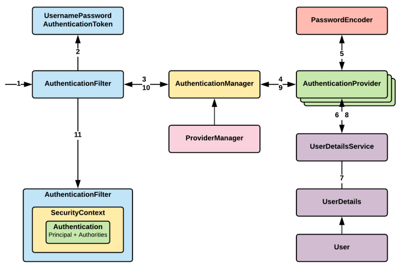
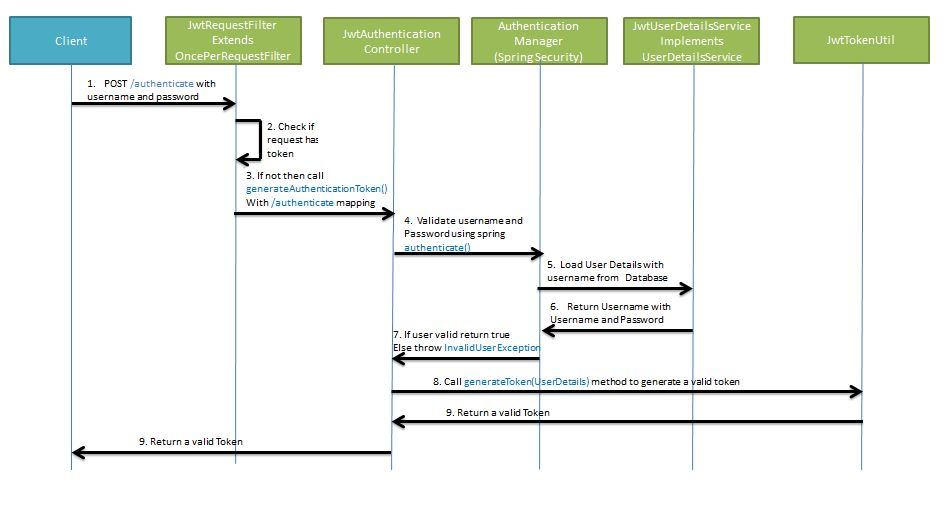
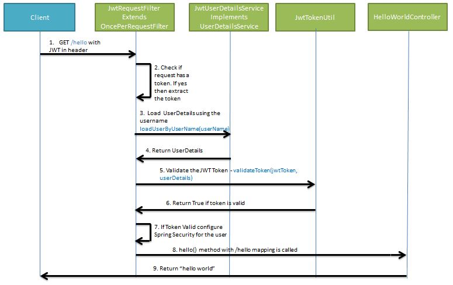

# Spring-Productos-DAM

Sencillo Microservicio para API Rest en Spring (SpringBoot) realizada conjuntamente con 2 DAM. Curso 2021/2022

[](https://spring.io)
[]()


- [Spring-Productos-DAM](#spring-productos-dam)
  - [API REST](#api-rest)
    - [Arquitectura](#arquitectura)
  - [Componentes Spring](#componentes-spring)
    - [Controladores](#controladores)
    - [Servicios](#servicios)
    - [Repositorios](#repositorios)
    - [Configuración](#configuración)
    - [Bean](#bean)
  - [IoC y DI en SpringBoot](#ioc-y-di-en-springboot)
    - [Inversión de Control](#inversión-de-control)
    - [Inyección de Dependencias](#inyección-de-dependencias)
    - [IoC y DI en Spring](#ioc-y-di-en-spring)
      - [A nivel de constructor](#a-nivel-de-constructor)
      - [A nivel de setter](#a-nivel-de-setter)
  - [DTO y Mappers](#dto-y-mappers)
  - [Fichero de propiedades](#fichero-de-propiedades)
  - [Spring Data](#spring-data)
    - [Repositorios](#repositorios-1)
    - [Definición de entidades](#definición-de-entidades)
    - [Definiciones de consultas](#definiciones-de-consultas)
  - [Spring Security](#spring-security)
    - [JWT](#jwt)
    - [Autenticación](#autenticación)
    - [Autorización](#autorización)
    - [Implementación en SpringBoot](#implementación-en-springboot)
  - [Documentación](#documentación)
  - [Postman](#postman)
  - [Autor](#autor)
    - [Contacto](#contacto)
  - [Licencia](#licencia)

## API REST

Sencilla Api REST con Spring Boot realizada con el alumnado para el curso de 2020/2021.
Con ella pondremos a prueba todo lo que hemos aprendido hasta el momento en Acceso a Datos y Programación de Servicios y Procesos.

En este proyecto realizaremos una API REST con Spring Boot. Es decir, un servicio web que accede a datos de una base de datos para gestionar un recurso, donde a su vez, podemos realizar operaciones CRUD (Create, Read, Update, Delete) implementando mecanismos autenticación y autorización.

### Arquitectura


## Componentes Spring
Nuestros componentes principales se etiquetarán con @ para que el framework Spring lo reconozca. Cada uno tiene una misión en nuestra arquitectura:


### Controladores
Se etiquetan como @Controller o en nuestro caso al ser una API REST como @RestController. Estos son los controladores que se encargan de recibir las peticiones de los usuarios y devolver respuestas.

### Servicios
Se etiquetan como @Service. Se encargan de implementar la parte de negocio o infraestructura. En nuestro caso puede ser el sistema de almacenamiento o parte de la seguridad y perfiles de usuario.

### Repositorios
Se etiquetan como @Repository e implementan la interfaz y operaciones de persistencia de la información. En nuestro caso, puede ser una base de datos o una API externa. Podemos extender de repositorios pre establecidos o diseñar el nuestro propio.

### Configuración
Se etiquetan como @Configuration. Se encargan de configurar los componentes de la aplicación. Se se suelen iniciar al comienzo de nuestra aplicación.

### Bean
La anotación @Bean, nos sirve para indicar que este bean será administrado por Spring Boot (Spring Container). La administración de estos beans se realiza mediante a anotaciones como @Configuration.

## IoC y DI en SpringBoot
### Inversión de Control
Inversión de control (Inversion of Control en inglés, IoC) es un principio de diseño de software en el que el flujo de ejecución de un programa se invierte respecto a los métodos de programación tradicionales. En su lugar, en la inversión de control se especifican respuestas deseadas a sucesos o solicitudes de datos concretas, dejando que algún tipo de entidad o arquitectura externa lleve a cabo las acciones de control que se requieran en el orden necesario y para el conjunto de sucesos que tengan que ocurrir.

### Inyección de Dependencias
 La inyección de dependencias (en inglés Dependency Injection, DI) es un patrón de diseño orientado a objetos, en el que se suministran objetos a una clase en lugar de ser la propia clase la que cree dichos objetos. Esos objetos cumplen contratos que necesitan nuestras clases para poder funcionar (de ahí el concepto de dependencia). Nuestras clases no crean los objetos que necesitan, sino que se los suministra otra clase 'contenedora' que inyectará la implementación deseada a nuestro contrato.

### IoC y DI en Spring
El contenedor Spring IoC lee el elemento de configuración durante el tiempo de ejecución y luego ensambla el Bean a través de la configuración. La inyección de dependencia de Spring se puede lograr a través del constructor, el método Setter y el dominio de entidad. Podemos hacer uso de la anotación @Autowired para inyectar la dependencia en el contexto requerido. O si usamos Lombok, podemos hacer uso de la anotación @Setter, @AllArgsConstructor, siempre y cuando declaremos como final las dependencias necesitadas.

#### A nivel de constructor
El contenedor llamará al constructor con parámetros al instanciar el bean, y cada parámetro representa la dependencia que queremos establecer. Spring analizará cada parámetro, primero lo analizará por tipo, pero cuando sea incierto, luego lo analizará de acuerdo con el nombre del parámetro (obtenga el nombre del parámetro a través de ParameterNameDiscoverer, implementado por ASM).
```java
@Service
public class UserService {
 
  private final UserDAO userDAO;
 
  @Autowired
  public UserService(UserDAO userDAO) {
    this.userDAO = userDAO;
  }
}
```

#### A nivel de setter 
Spring primero instancia el Bean y luego llama al método Setter que debe inyectarse para lograr la inyección de dependencia.
```java
@Service
public class UserService {
 
  private UserDAO userDAO;
    
  @Autowired
  public void setUserDAO(UserDAO userDAO) {
    this.userDAO = userDAO;
  }
}
```
## DTO y Mappers
Usaremos los DTO, como objetos de transporte y con ellos facilitar la transición entre Request y objetos del modelo, y objetos de modelo y Responses. De esta manera podemos ensamblar y desensamblar los objetos de modelo y de transporte según nuestra necesidades.

Los mapeadores nos ayudarán en la misión de mapear los objetos de modelo a objetos de transporte y viceversa. Podemos usar una librería específica para ello como [ModelMapper](http://modelmapper.org/), o podemos usar un mapeador propio.

## Fichero de propiedades
A la hora de utilizar el contenedor de Spring es una buena práctica separar la configuración de los beans, parcial o totalmente realizada en ficheros XML o clases de configuración (internamente), y los parámetros de configuración que utilizan esos beans como por ejemplo contraseñas o la ubicación de la base de datos. 

Lo habitual es definir los parámetros de configuración en ficheros de propiedades estándar de Java (.properties). Spring permite utilizar cómodamente este tipo de ficheros tal y como vamos a ver y con ello realizar la configuración de los beans sin pasar por el tedioso proceso de configuración de XML.

Podemos tener distintos ficheros por ejemplo para desarrollo y producción.

## Spring Data
Spring Data es una librería de persistencia que nos permite acceder a bases de datos relacionales de forma sencilla. Para ello podemos extender de la clase [JpaRepository](https://docs.spring.io/spring-data/jpa/docs/current/reference/html/#jpa.repositories), que es una clase de repositorio de Spring Data con más funcionalidades, como pueden ser las operaciones de consulta, inserción, actualización y eliminación, así como las de paginación, ordenación o búsquedas.

### Repositorios
Los principales son:
- CrudRepository: tiene las mayoría d elas funcionalidades CRUD.
- PagingAndSortingRepository: ofrece mecanismos de paginación, ordenación y búsqueda.
- JpaRepository: proporciona algunos métodos relacionados con JPA, como vaciar el contexto de persistencia y eliminar registros en un lote.

Podemos trabajar con BBDD relacionales de forma sencilla con Spring Data o usar la versión específica para MongoDB.

### Definición de entidades
Usaremos las anotaciones de JPA para definir entidades o colecciones, sus atributos y características de los mismos, así como las relacionales existentes.

### Definiciones de consultas
Podemos definir consultas personalizadas para las entidades de la aplicación. Para ello podemos usar la anotación @Query con JPQL o @NativeQuery y usar el lenguaje del motor de Base de Datos.

Por otro lado, también podemos definir las consultas en base del nombre del método. Si lo definimos con una [signatura determinada con ellos se generará la consulta automáticamente](https://docs.spring.io/spring-data/jpa/docs/current/reference/html/#jpa.query-methods.query-creation).

Es importante que usando 

## Spring Security
[Spring Security](https://spring.io/projects/spring-security) es una librería de seguridad que nos permite controlar el acceso a nuestra aplicación permitiendo mecanismos de autenticación y autorización en base a roles.

Para ello haremos uso de UserDetailsService, un servicio que nos permitirá cargar datos específicos del usuario.

Además, actuará como middleware, analizando las rutas y con ellas a base de roles saber si se puede permitir el acceso a operar con ellas.



### JWT
Spring Security ofrece una librería para generar y verificar [JWT](https://jwt.io/introduction). Gracias a ella podemos realizar el proceso de autenticación y autorización. Json Web Token es un estándar que define una forma auto contenida de transmitir información como JSON. Consta de tres partes separadas por puntos.
- Header: algoritmo (SHA256, HS512 …) y el tipo de token.
- Payload: contiene las propiedades(claims) del token.
- Signature: header (codificado en base64), payload (codificado en base64), una clave, y todo firmado con el algoritmo del header.
- Claim: porción de información en el cuerpo del token.

La arquitectura de Spring Security para JWT es la siguiente


### Autenticación


### Autorización


### Implementación en SpringBoot
Podemos implementar la autenticación y autorización de Spring Security en SpringBoot con JWT de la siguiente manera.

- Usuarios que extiendan de UserDetails, con ellos usaremos los mecanismos de Spring Security nos indica. Deberemos tener el campo username y password. Además usaremos una lista de roles para la parte de autenticación. 
- CustomUserDetailsService que implementa UserDetailsService con los métodos: loadUserByUsername() y loadUserById().
- Configuración del PasswordEncoder, por ejemplo con BCryptPasswordEncoder.
- JwtTokenProvider, donde implementamos los datos del JWT y con ello generar los JWT según nuestras necesidades, así como verificar los mismos.
- JwtAuthorizationFilter que extiende de OncePerRequestFilter. Nos permite definir el filtro de la cadena de autenticación/autorización en base al contenido del JWT y de nuestra información en BB.DD.
- JwtAuthenticationEntryPoint que implementa AuthenticationEntryPoint. Nos permite definir el comportamiento de la aplicación cuando no se ha autenticado o el JWT no es el correcto.
- SecurityConfig que extiende de WebSecurityConfigurerAdapter. Es la clase principal del sistema de Spring Security y se define en base a todas las anteriores.
  - Usará userDetailsService y passwordEncoder.
  - Su authenticationEntryPoint será en base a jwtAuthenticationEntryPoint
  - Definiremos las políticas de acceso en base a roles si ha pasado la autenticación. Es decir, las políticas de autorización por rutas, o verbos HTTP.
  - Aplicará todo estos procesos en base a a los filtros definidos en jwtAuthorizationFilter.

## Documentación
Para documentar nuestra API REST podemos hacer uso de [Swagger](https://swagger.io/). Swagger es un conjunto de herramientas de software de código abierto para diseñar, construir, documentar, y utilizar servicios web RESTful. Además podemos usar su UI para testear nuestra API.

## Postman
Para probar nuestra API podemos usar [Postman](https://www.getpostman.com/). Con ella podemos [probar nuestra API REST](./postman/Spring-Productos-DAM.postman_collection.json) y analizar su comportamiento. Además podemos documentarla y subirla a la nube para que pueda ser probada por otros usuarios.

## Autor

Codificado con :sparkling_heart: por [José Luis González Sánchez](https://twitter.com/joseluisgonsan)

[](https://twitter.com/joseluisgonsan)
[](https://github.com/joseluisgs)

### Contacto

<p>
  Cualquier cosa que necesites házmelo saber por si puedo ayudarte 💬.
</p>
<p>
    <a href="https://twitter.com/joseluisgonsan" target="_blank">
        
    </a> &nbsp;&nbsp;
    <a href="https://github.com/joseluisgs" target="_blank">
        
    </a> &nbsp;&nbsp;
    <a href="https://www.linkedin.com/in/joseluisgonsan" target="_blank">
        
    </a>  &nbsp;&nbsp;
    <a href="https://joseluisgs.github.io/" target="_blank">
        
    </a>
</p>

## Licencia

Este proyecto está licenciado bajo licencia **MIT**, si desea saber más, visite el fichero [LICENSE](./LICENSE) para su
uso docente y educativo.